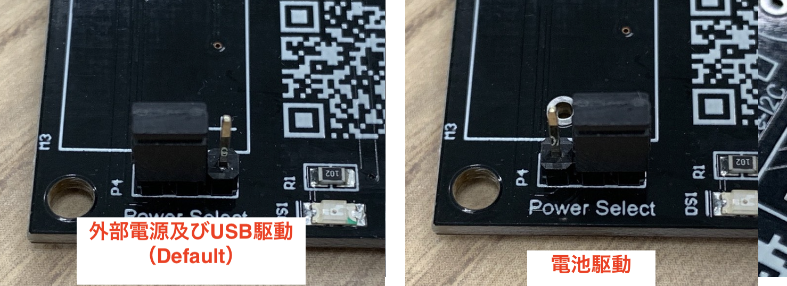
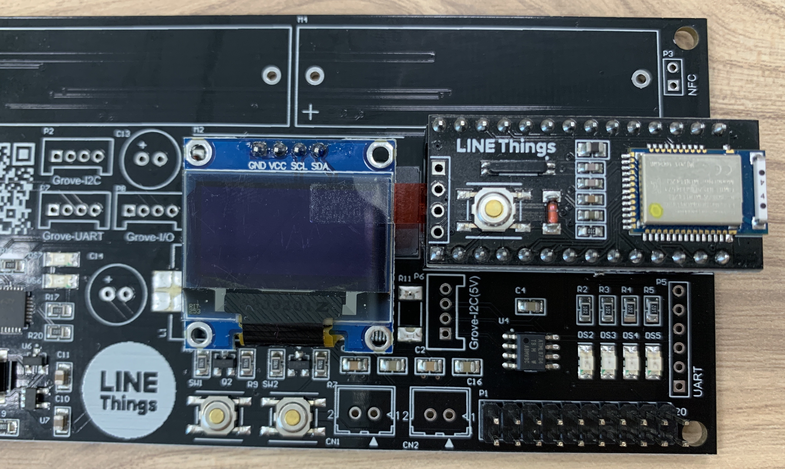
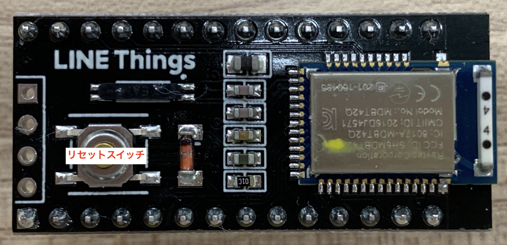
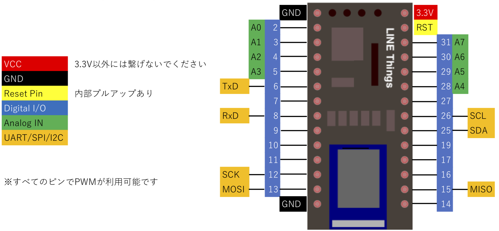
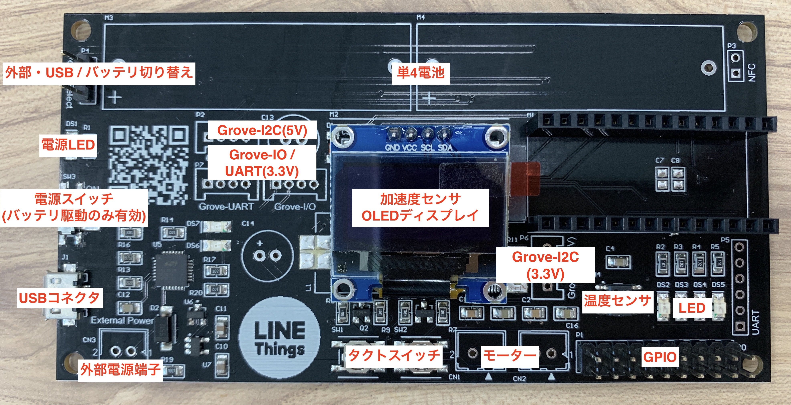

# LINE Things development board
LINE Things development boardは、[Nordic Semiconductor nRF52832](https://www.nordicsemi.com/Products/Low-power-short-range-wireless/nRF52832)を搭載している[Raytac MDBT42Q](http://www.raytac.com/product/ins.php?index_id=31)モジュールを搭載したLINE Things実験用ボードです。
CPUボードとマザーボードの2つの基板から構成されています。組み合わせることで動作検証をすることや、CPUボードは単体でもブレッドボード等を使って実験を行うことが可能です。

[Adafruitがオープンソースで公開しているArduinoコア](https://github.com/adafruit/Adafruit_nRF52_Arduino)を利用可能なため、Arduino IDEで簡単にLINE Thingsの機能を実験することが可能です。

この資料では各ボードの使い方、ボード上に搭載しているデバイスに関しての詳細について紹介しています。
LINE ThingsやBluetooth LEの使い方などに関してはそれぞれのページを参照してください。

- [LINE Things - LINE Developers](https://developers.line.biz/ja/docs/line-things/)
- [LINE Things Starter](https://github.com/line/line-things-starter)

### [重要] Groveコネクタを使う方への注意点

本体のみ使用する場合は問題ありませんが、 **Groveコネクタの基板の説明に間違い** があります。

* 基板上の**P7**と**P8**は説明が逆になっています。正しくは**P7**はGrove-I/Oで、**P8**がGrove-UARTです。
* 基板上の説明では**P6**にGrove-I2C 5Vと記載されていますが、正しくは**P6**がI2C(3.3V)、**P2**がI2C(5V)となります。

## Quick Start
予め書かれているファームウェアで、LINE Thingsの機能とボード上に搭載されたデバイスの体験をすることができます。
LINE Things上でモーターを除くすべてのデバイスの状態を取得することや、LEDの制御を行うことができます。
デバイスの電源を入れ、LINE App の LINE Things から接続することで、 Notify や デバイスへの Write を試すことができます。
初期状態のファームウェアは出力パワーを最低に設定しています。端末をデバイスに近づけて利用してください。

### 初めてLINE Thingsを使用する方
初めてLINE Thingsを使用する場合、まずはLINEアプリ内のQRコードリーダーでCPU基板の裏側、またはマザーボード基板にあるQRコードを読み取って利用規約に同意してください。

### デフォルトファームウェアの機能を使う
デフォルトファームウェアでは、ファームウェアを書き換えることなく、LIFFからLINEデバイスの挙動をより高度にコントロールする機能も用意しています。
この機能を用いると、例えば任意のタイミングでデバイスからNotifyさせたり、各種センサの値を任意に設定したり、取得することが可能です。
LIFFのJavaScript APIから、このデフォルトファームウェアの機能を簡単に使うためのライブラリも用意しています。

デフォルトファームウェアの仕様については、[デフォルトファームウェアについて](docs/default-firmware.md)を参照してください。
JavaScriptライブラリについては、[JavaScript から LINE Things Board を制御する](docs/js-control.md)を参照してください。
デフォルトファームウェアを利用したLIFFは `liff-app/linethings-dev-default/` と `liff-app/linethings-js-control/` に格納されています。

このファームウェアは Advertising packet の Service UUID を LIFF 上から書き換える機能を持っています。
この機能は LINE Developers から Service UUID を取得して、LINE Things developers trial の独自デバイスを構築する際に、
ファームウェアと LIFF を変更することなく独自のデバイスとして使用することを目的とした機能です。

#### LIFFからService UUIDの変更と初期化
LINE Things Developer Trialでは、プロダクト登録とそれに対応したGATT Service UUIDの設定が必要です。
デフォルトファームウェアと LIFF (liff-app/linethings-dev-default/) では、LIFF上からService UUIDを書き換えることが可能です。
この機能を用いると、Service UUIDの書換の際にデバイスのファームウェアの書き換えが不要となります。

##### LIFFからService UUIDを書き換える
LINE AppからデフォルトのLIFFを開き、Write advertising packetタブを表示します。
設定したいService UUIDをテキストボックスに入れて書き換えボタンを押すと、
Dev boardのディスプレイに「BLE advertising uuid changed from LIFF....」 と表示されていれば成功です。

ディスプレイにこのメッセージが出ていることを確認して、 **LINE AppのLINE Thingsを閉じて、dev boardのリセットボタンを押して** ください。

##### Service UUIDを初期状態に戻す
電源が入っている状態で、マザーボード上のSW1タクトスイッチを押しながら、CPUボード上のリセットボタンを押してください。
起動時に `Set advertising packet UUID to default.` とディスプレイに表示されたら成功です。

### ファームウェアをカスタマイズする
[Adafruitがオープンソースで公開しているArduinoコア](https://github.com/adafruit/Adafruit_nRF52_Arduino)を利用して、Arduino IDEから簡単に開発することが可能です。

ハードウェアの仕様については、[ハードウェア構成](#ハードウェア構成)を参考にしてください。
ファームウェアの書き込み方法に関しては[ファームウェア書き込み方法](#ファームウェア書き込み方法)を参考にしてください。
サンプルコードについては、[サンプルコード](docs/examples.md)にそれぞれのデバイスを制御する方法を載せています。

デフォルトファームウェアに戻したい場合には、`arduino/linethings-dev-default/linethings-dev-default.ino` を使用してください。
このサンプルでは `things_temp_lib`、`SparkFun MMA8452Q Accelerometer`、`Adafruit SSD1306`、`Adafruit GFX Library` を使用しています。`things_temp_lib` は `library/things_temp_lib` をzipファイルに圧縮して、ライブラリをインクルードからインストールしてください。それ以外のライブラリはライブラリを管理からインストールしてください。

---

## 使用方法
### マザーボードにCPU基板を挿して使用する
ここではCPUボードをマザーボードに挿して使用する方法を説明します。
はじめに、CPUボードをマザーボードに差し込む場合は **方向を間違えないように必ず確認** してください。Bluetoothアンテナが基板の**外側**を向くようにとおぼえておくと良いでしょう。

#### 1. 電源を選択します
マザーボードは外部電源及びUSB駆動または電池駆動をさせることが可能です。これらの設定を行う前にかならず *SW3* の電源スイッチをOFFにしてください。
USB接続の場合はUSBケーブルを抜いてください。
電源の設定は *P4* ピンで行うことができます。上側に設定することで外部電源及びUSB駆動、下側を設定すると電池駆動になります。

 * 外部電源及びUSB駆動
   * *P4* を写真のように正面から見て上側に設定してください。
 * 電池駆動
   * *P4* を写真のように正面から見て下側に設定してください。

※単4電池駆動の場合5V系は使用できません。外部電源駆動にして使用してください。 \
※USB電源駆動ではモーターを使用しないでください。外部電源駆動にして使用してください。

#### 2. 電源をONにします。

* 外部電源及びUSB駆動
  * *CN3* に電源を、またはUSBケーブルを接続してください。電源スイッチにかかわらずデバイスがONになります。
* 電池駆動
  * 電池を搭載して、*SW3* の電源スイッチをON(上側)にしてください。

電源LED(*DS1*)が光っていることを確認してください。以上で使用できる準備が整いました。

### CPU基板単体で使用する
電源さえ給電すれば単体動作可能となります。Resetピンは内部でプルアップしているので使用しない場合は非接続で構いません。

## 使用上の注意
### CPUボード

 * マザーボードに差し込む場合は必ず方向を間違えないように確認してください。
 * CPUボードを単体で使用する場合、安定したBLEの通信を行うため、アンテナが配置されている側をなるべくGNDや他の電極パターンに近づけないでください。ブレッドボード上に配置する場合は、アンテナをブレッドボードの端になるようにしてください。
 * BLE通信を行う場合、アンテナが露出していることが望ましいです。ケースに入れる場合は金属ケースなどを使用せず、プラスチックケースを使用してください。

### マザーボード
 * 基板上のP7とP8は説明が逆になっています。正しくはP7はGrove-I/Oで、P8がGrove-UARTです。
 * 基板上の説明ではP6にGrove-I2C 5Vと記載されていますが、正しくはP6がI2C(3.3V)、P2がI2C(5V)となります。
 * 電源供給として電池を使用する場合は、電池の極性を間違えないようにしてください。間違えた場合デバイスが破損してしまうことがあります。
 * 3.3Vを外部に供給する場合は、CPU基板を含め全体で600mAを超えない範囲で使用してください。超えてしまうと電源ICが破損してしまうことがあります。
 * 外部電源を使用する場合は必ず電圧と極性を確認してください。
 * 一部パターンのみ用意されていて、はんだ付けされていない部品があります。必要に応じて適宜追加してください。

---

## ハードウェア構成
### CPUボード

[Raytac MDBT42Q](http://www.raytac.com/product/ins.php?index_id=31)モジュールを搭載しています。
AdafruitのArduinoコアを利用可能でArduino IDEを使用して開発することができ、J-LINKなどから利用できるJTAG(SWD)ポートを用意しているので、
Arduinoではなくご自身でフルスクラッチ開発も可能となっています。マザーボードに挿して使用することも、CPUボード単体で使用することも可能です。

#### ピンアサイン

#### 技術仕様
CPUボード単体での仕様です。マザーボードに接続して使用する場合、そちらの仕様が適用されます。

| 項目 | 値 |
----|----
| 動作可能電圧 | 1.7~3.6V |
| 最大RFパワー | 4dBm |
| Flashサイズ | 512KB |
| RAMサイズ | 64KB |

### マザーボード

マザーボード上にはLED、タクトスイッチ、温度センサやOLEDなどを搭載しています。
使用する際はCPUボードを挿して使用します。**CPUボードを挿す際は向きに注意** してください。向きを間違うと
デバイスが壊れてしまうこともあるのでご注意ください。

#### 技術仕様
| 項目 | 値 |
----|----
| 電源ソース | 電池/USB/外部供給 |
| 動作可能電圧(電池) | 3V(単4電池1.5Vを２本直列) |
| 動作可能電圧(USB) | 5V |
| 動作可能電圧(外部供給) | 5V |
| 最大連続消費電流(電池駆動/モーター未使用) | 0.6A |
| 最大連続消費電流(モーター使用時) | 2.6A |

## マザーボード搭載デバイス
5V系統と記載があるものは電池駆動では使用できません。外部電源を使用するかUSB接続で使用する必要があります。また、GroveコネクタやGPIOにて3.3V駆動デバイスに5V系統を接続したり、
逆に5V駆動デバイスに3.3V系統を接続すると、マイコンや接続デバイスの破損につながるため、接続する電源系統はご注意ください。

特に記載がないものは3.3V系統です。5V系統のものに関しては明示的に記載しております。

### LED
LEDはアノード側がマイコンに接続されています。よってマイコンでHighを出力するとLEDが点灯します。使用する際はポートを出力設定にしてください。

| 基板上番号 | マイコンピン番号 |
----|----
| DS2 | 7 |
| DS3 | 11 |
| DS4 | 19 |
| DS5 | 17 |

### タクトスイッチ
タクトスイッチは回路上でプルアップしていないので、必ずマイコン側でプルアップ付き入力(INPUT_PULLUP)で使用してください。

| 基板上番号 | マイコンピン番号 |
----|----
| SW1 | 29|
| SW2 | 28 |

### ブザー
圧電ブザーが搭載されています。このブザーで音を鳴らすにはマイコンから交流信号を出力する必要があります(マイコンの出力をHighにしただけでは出力されません)。
通常のArduinoであればtone()関数で任意の音を出すことが可能ですが、nRF52832のArduino環境ではこれを使うことができません。よってタイマー割り込みなどでON/OFFを繰り返して音を鳴らす必要があります。
ここで紹介しているサンプルではFreeRTOSのタイマーを使って1KHzの割り込みを作り、そこでピンの状態を反転することで500Hzのブザー音を生成しています。
より高い周波数で鳴らしたい場合は、nRF52832のハードウェアタイマーを設定する必要があります。

| 基板上番号 | マイコンピン番号 |
----|----
| BZ1 | 27 |

### OLED
128x64ピクセルの有機EL(SSD1306)を搭載しています。I2Cで接続されており、
Adafruit SSD1306などのライブラリを使用すると簡単に使うことができます。I2Cのアドレスは0x3Dとなります。

| ピン名称 | マイコンピン番号 |
----|----
| SCL | 26 |
| SDA | 25 |

### 温度センサ
温度センサ(AT30TS74)を搭載しています。I2Cで接続されており、
簡単な制御で使うことができます。I2Cのアドレスは0x48となります。

| デバイスピン | マイコンピン番号 |
----|----
| SCL | 26 |
| SDA | 25 |

### 加速度センサ
加速度センサ(MMA8452Q)を搭載しています。I2Cで接続されており、
SparkFun MMA8452Q Accelerometerライブラリを使うと簡単な制御で使うことができます。I2Cのアドレスは0x1Cとなります。

| デバイスピン | マイコンピン番号 |
----|----
| SCL | 26 |
| SDA | 25 |

### モーター
モータードライバ(DRV8830)を2つ搭載することが可能です。I2Cで接続されており、
簡単な制御で使うことができます。モーターは *CN1* と *CN2* に接続することが可能です。I2Cのアドレスは0x60(CN1)、0x62(CN2)となります。

| デバイスピン | マイコンピン番号 |
----|----
| SCL | 26 |
| SDA | 25 |

#### 注意事項
* 初期状態でモータードライバは搭載されていません。使用するにはいくつかの部品を取り外し、必要な部品をご自身ではんだ付けする必要があります。
詳しくは[モータードライバ](#モータードライバ)を御覧ください。
* 5V系統です。電池駆動ではご使用になれません。使用する場合は外部電源またはUSB給電をする必要があります。

### Grove端子(I2C)
基板上では端子 *P6* となります。(基板上の説明ではP6にGrove-I2C 5Vと記載されていますが、正しくはP6がI2C-3.3V、P2がI2C-5Vとなります)

| コネクタピン番号 | ピン名称 | マイコンピン番号 |
----|----|----
| 1 | SCL | 26 |
| 2 | SDA | 25 |
| 3 | 3.3V  | - |
| 4 | GND | - |

#### 注意事項
* 初期状態でこのコネクタは搭載されていません。使用するにはGroveコネクタをご自身ではんだ付けする必要があります。
* 基板上の説明ではP6にGrove-I2C 5Vと記載されていますが、正しくはP6がI2C-3.3V、P2がI2C-5Vとなります。

### Grove端子(I2C / 5V系統)
基板上では端子 *P2* となります。

| コネクタピン番号 | ピン名称 | マイコンピン番号 |
----|----|----
| 1 | SCL | 26 |
| 2 | SDA | 25 |
| 3 | 5V  | - |
| 4 | GND | - |

#### 注意事項
* 初期状態でこのコネクタは搭載されていません。使用するにはGroveコネクタをご自身ではんだ付けする必要があります。
* 基板上の説明ではP6にGrove-I2C 5Vと記載されていますが、正しくはP6がI2C-3.3V、P2がI2C-5Vとなります。
* 5V系統です。電池駆動ではご使用になれません。使用する場合は外部電源またはUSB給電をする必要があります。
* 接続する機器は5Vで動作するものを接続してください。3.3Vのデバイスを接続するとデバイスが破損する可能性があるのでご注意ください。

### Grove端子(UART)
基板上に *P8 / Grove-I/O* と印刷されているコネクタです。（P7はGrove-I/Oで、P8がGrove-UARTです）

| コネクタピン番号 | ピン名称 | マイコンピン番号 |
----|----|----
| 1 | RxD | 6 |
| 2 | TxD | 8 |
| 3 | 3.3V  | - |
| 4 | GND | - |

#### 注意事項
* 初期状態でこのコネクタは搭載されていません。使用するにはGroveコネクタをご自身ではんだ付けする必要があります。

### Grove端子(汎用デジタルI/O)
基板上に *P7 / Grove-UART* と印刷されているコネクタです。（P7はGrove-I/Oで、P8がGrove-UARTです）

| コネクタピン番号 | ピン名称 | マイコンピン番号 |
----|----|----
| 1 | D0 | 2 |
| 2 | D1 | 3 |
| 3 | 3.3V  | - |
| 4 | GND | - |

#### 注意事項
* 初期状態でこのコネクタは搭載されていません。使用するにはGroveコネクタをご自身ではんだ付けする必要があります。

### GPIO
基板上では端子 *P1* となります。

6ピンはリセットピンです。Lowにすることでマイコンをリセットすることが可能です。CPU基板側でプルアップされているため、未使用の場合は非接続で構いません。

| コネクタピン番号 | ピン名称 | マイコンピン番号 |
----|----|----
| 1 | I/O | 2 |
| 2 | 5V | - |
| 3 | I/O | 3 |
| 4 | 3.3V | - |
| 5 | I/O | 4 |
| 6 | RESET | - |
| 7 | I/O | 5 |
| 8 | I/O | 26(SCL) |
| 9 | I/O | 12 |
| 10 | I/O | 25(SDA) |
| 11 | I/O | 13 |
| 12 | I/O | 16 |
| 13 | I/O | 14 |
| 14 | I/O | 15 |
| 15 | I/O | 8(RxD) |
| 16 | O | 11(LED-DS3) |
| 17 | I/O | 6(TxD) |
| 18 | O | 7(LED-DS2) |
| 19 | GND |  |
| 20 | GND |  |

#### 注意事項
* 8, 10ピンはI2C端子に接続されています。このピンはボード上のI2Cデバイスでも使用しているため、汎用I/OではなくI2Cピンとして使用することを強くおすすめします。
* 15, 17ピンはUART端子に接続されています。このピンはファームウェアの書き込み等でも使用しているため、汎用I/OではなくUARTピンとして使用することを強くおすすめします。
* 16, 18ピンはボード上でLED端子に接続されています。そのため、基本的にOutput端子として使用してください。

## 回路図・アートワーク図
- CPU ボード
    - [回路図](https://github.com/line/line-things-dev-board/blob/master/schematics/cpu_board/Outputs/schematic.pdf)
    - [アートワーク図 - 表](https://github.com/line/line-things-dev-board/blob/master/schematics/cpu_board/Outputs/pcb_top.pdf)
    - [アートワーク図 - 裏](https://github.com/line/line-things-dev-board/blob/master/schematics/cpu_board/Outputs/pcb_bottom.pdf)
- マザーボード
    - [回路図](https://github.com/line/line-things-dev-board/blob/master/schematics/main_board/Outputs/schematic.pdf)
    - [アートワーク図 - 表](https://github.com/line/line-things-dev-board/blob/master/schematics/main_board/Outputs/pcb_top.pdf)
    - [アートワーク図 - 裏](https://github.com/line/line-things-dev-board/blob/master/schematics/main_board/Outputs/pcb_bottom.pdf)

### 自分で基板を製造したい
`/cpu_board/Outputs/`
`/main_board/Outputs/`

基板製造に必要なガーバーデータがここに格納されています。実装に必要な部品リストは bom_{cpu/main}_board.xls を使用してください。
なお、回路図及び基板データは Altium 社の Circuit Studio でデザインしています。設計データを変更する場合、Circuit Studio から開いてください。
https://www.altium.com/circuitstudio/

## 拡張
### モータードライバ
マザーボードはモータードライバが実装されていないため、そのままではモーターを使用することができません。
モーターを使用したい場合は *R18* (0オーム)を取り外して、以下の部品を新規に追加実装してください。

DRV8830DGQRは裏のGNDパッドを基板の裏側からハンダを流してはんだ付けしてください。

| 追加部品基板シルク | 部品 | パラメータ |
----|----|----
| U1 | IC | DRV8830DGQR |
| U2 | IC | DRV8830DGQR |
| L1 | コイル | 100uF / 2A |
| C1 | コンデンサ | 1000pF |
| C2 | コンデンサ | 1000pF |
| C13 | コンデンサ | 100uF / 16V |
| C14 | コンデンサ | 470uF / 16V |
| R10 | 抵抗 | 0.2Ω / 2W |
| R11 | 抵抗 | 0.2Ω / 2W |
| CN1 | コネクタ | JST-XH-02P |
| CN2 | コネクタ | JST-XH-02P |

### 電源 / Groveコネクタ
電源コネクタはJST-XH-02Pコネクタを使用しています。Groveコネクタは4Pの標準のものを使用しています。

### 電池ボックス
電池ボックスは共立電子産業さん、または秋月電子通商さんにて購入可能な単4電池ボックスを2つ使用しています。

- http://eleshop.jp/shop/g/g6CM128/
- http://akizukidenshi.com/catalog/g/gP-02670/
