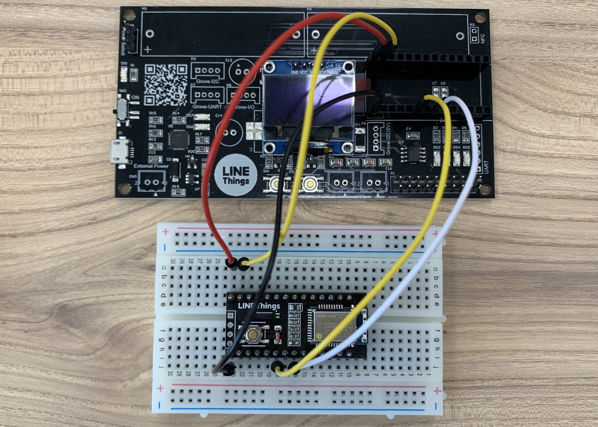
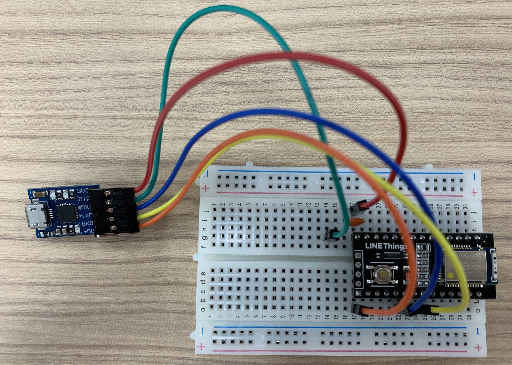
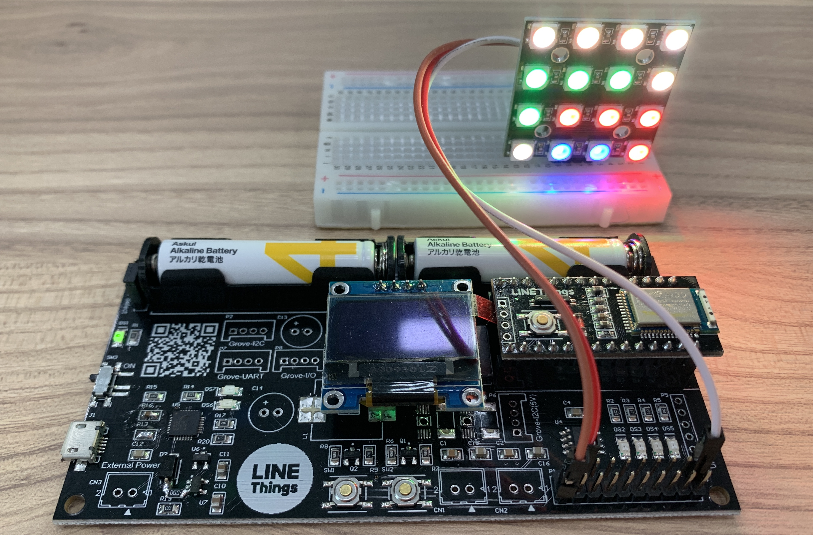
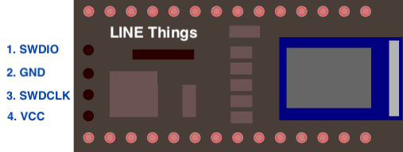

# LINE Things development board
LINE Things development boardは、[Nordic Semiconductor nRF52832](https://www.nordicsemi.com/Products/Low-power-short-range-wireless/nRF52832)を搭載している[Raytac MDBT42Q](http://www.raytac.com/product/ins.php?index_id=31)モジュールを搭載したLINE Things実験用ボードです。
CPUボードとマザーボードの2つの基板から構成されています。組み合わせることで動作検証をすることや、CPUボードは単体でもブレッドボード等を使って実験を行うことが可能です。

[Adafruitがオープンソースで公開しているArduinoコア](https://github.com/adafruit/Adafruit_nRF52_Arduino)を利用可能なため、Arduino IDEで簡単にLINE Thingsの機能を実験することが可能です。

この資料では各ボードの使い方、ボード上に搭載しているデバイスに関しての詳細について紹介しています。
LINE ThingsやBluetooth LEの使い方などに関してはそれぞれのページを参照してください。

- [LINE Things - LINE Developers](https://developers.line.biz/ja/docs/line-things/)
- [LINE Things Starter](https://github.com/line/line-things-starter)

## Groveコネクタを使う方への注意点

本体のみ使用する場合は問題ありませんが、 **Groveコネクタの基板の説明に間違え** があります。

* 基板上のP7とP8は説明が逆になっています。正しくはP7はGrove-I/Oで、P8がGrove-UARTです。
* 基板上の説明ではP6にGrove-I2C 5Vと記載されていますが、正しくはP6がI2C(3.3V)、P2がI2C(5V)となります。

## CPUボード


[Raytac MDBT42Q](http://www.raytac.com/product/ins.php?index_id=31)モジュールを搭載しています。
AdafruitのArduinoコアを利用可能でArduino IDEを使用して開発することができ、J-LINKなどから利用できるJTAG(SWD)ポートを用意しているので、
Arduinoではなくご自身でフルスクラッチ開発も可能となっています。マザーボードに挿して使用することも、CPUボード単体で使用することも可能です。

### ピンアサイン


### 技術仕様
CPUボード単体での仕様です。マザーボードに接続して使用する場合、そちらの仕様が適用されます。

| 項目 | 値 |
----|----
| 動作可能電圧 | 1.7~3.6V |
| 最大RFパワー | 4dBm |
| Flashサイズ | 512KB |
| RAMサイズ | 64KB |

## マザーボード


マザーボード上にはLED、タクトスイッチ、温度センサやOLEDなどを搭載しています。
使用する際はCPUボードを挿して使用します。**CPUボードを挿す際は向きに注意** してください。向きを間違うと
デバイスが壊れてしまうこともあるのでご注意ください。

### 技術仕様
| 項目 | 値 |
----|----
| 電源ソース | 電池/USB/外部供給 |
| 動作可能電圧(電池) | 3V(単4電池1.5Vを２本直列) |
| 動作可能電圧(USB) | 5V |
| 動作可能電圧(外部供給) | 5V |
| 最大連続消費電流(電池駆動/モーター未使用) | 0.6A |
| 最大連続消費電流(モーター使用時) | 2.6A |

---

# Quick Start
予め書かれているファームウェアで、LINE Thingsの機能とボード上に搭載されたデバイスの体験をすることができます。
LINE Things上でモーターを除くすべてのデバイスの状態を取得することや、LEDの制御を行うことができます。
デバイスの電源を入れ、LINE App の LINE Things から接続することで、 Notify や デバイスへの Write を試すことができます。
初期状態のファームウェアは出力パワーを最低に設定しています。端末をデバイスに近づけて利用してください。

ファームウェアを書き換えることなく、LIFFからLINEデバイスの挙動をより高度にコントロールする機能も用意しています。
この機能を用いると、例えば任意のタイミングでデバイスからNotifyさせたり、各種センサの値を任意に設定したり、取得することが可能です。
これらの使い方は[Java Scriptからデバイスをより高度にコントロールする方法](tree/master/liff-app/js-control)を参照してください。

このファームウェアは Advertising packet の Service UUID を LIFF 上から書き換える機能を持っています。
この機能は LINE Developers から Service UUID を取得して、LINE Things developers trial の独自デバイスを構築する際に、
ファームウェアと LIFF を変更することなく独自のデバイスとして使用することを目的とした機能です。よくわからない方はこの機能を使用してないでください。

このファームウェアは予め書き込まれていますが、書き換えたい場合などは `arduino/linethings-dev-default/linethings-dev-default.ino` を使用してください。
このサンプルでは `things_temp_lib`、`SparkFun MMA8452Q Accelerometer`、`Adafruit SSD1306`、`Adafruit GFX Library` を使用しています。`things_temp_lib` は `library/things_temp_lib` をzipファイルに圧縮して、ライブラリをインクルードからインストールしてください。それ以外のライブラリはライブラリを管理からインストールしてください。


このサンプルで使用しているLIFFは `liff-app/linethings-dev-default/` に格納されています。
ファームウェアの書き込み方法に関しては[ファームウェア書き込み方法](#ファームウェア書き込み方法)を参考にしてください。

## 初めてLINE Thingsを使用する方
初めてLINE Thingsを使用する場合、まずはLINEアプリ内のQRコードリーダーでCPU基板の裏側、またはマザーボード基板にあるQRコードを読み取って利用規約に同意してください。

---

# 使用上の注意
## CPUボード


 * マザーボードに差し込む場合は必ず方向を間違えないように確認してください。
 * CPUボードを単体で使用する場合、安定したBLEの通信を行うため、アンテナが配置されている側をなるべくGNDや他の電極パターンに近づけないでください。ブレッドボード上に配置する場合は、アンテナをブレッドボードの端になるようにしてください。
 * BLE通信を行う場合、アンテナが露出していることが望ましいです。ケースに入れる場合は金属ケースなどを使用せず、プラスチックケースを使用してください。


## マザーボード
 * 基板上のP7とP8は説明が逆になっています。正しくはP7はGrove-I/Oで、P8がGrove-UARTです。
 * 基板上の説明ではP6にGrove-I2C 5Vと記載されていますが、正しくはP6がI2C(3.3V)、P2がI2C(5V)となります。
 * 電源供給として電池を使用する場合は、電池の極性を間違えないようにしてください。間違えた場合デバイスが破損してしまうことがあります。
 * 3.3Vを外部に供給する場合は、CPU基板を含め全体で600mAを超えない範囲で使用してください。超えてしまうと電源ICが破損してしまうことがあります。
 * 外部電源を使用する場合は必ず電圧と極性を確認してください。
 * 一部パターンのみ用意されていて、はんだ付けされていない部品があります。必要に応じて適宜追加してください。


# 使用方法
## マザーボードにCPU基板を挿して使用する
ここではCPUボードをマザーボードに挿して使用する方法を説明します。
はじめに、CPUボードをマザーボードに差し込む場合は **方向を間違えないように必ず確認** してください。Bluetoothアンテナが基板の**外側**を向くようにとおぼえておくと良いでしょう。

### 1. 電源を選択します
マザーボードは外部電源及びUSB駆動または電池駆動をさせることが可能です。これらの設定を行う前にかならず *SW3* の電源スイッチをOFFにしてください。
USB接続の場合はUSBケーブルを抜いてください。
電源の設定は *P4* ピンで行うことができます。上側に設定することで外部電源及びUSB駆動、下側を設定すると電池駆動になります。


 * 外部電源及びUSB駆動
   * *P4* を写真のように正面から見て上側に設定してください。
 * 電池駆動
   * *P4* を写真のように正面から見て下側に設定してください。

※単4電池駆動の場合5V系は使用できません。外部電源駆動にして使用してください。 \
※USB電源駆動ではモーターを使用しないでください。外部電源駆動にして使用してください。


### 2. 電源をONにします。

* 外部電源及びUSB駆動
  * *CN3* に電源を、またはUSBケーブルを接続してください。電源スイッチにかかわらずデバイスがONになります。
* 電池駆動
  * 電池を搭載して、*SW3* の電源スイッチをON(上側)にしてください。

電源LED(*DS1*)が光っていることを確認してください。以上で使用できる準備が整いました。

## CPU基板単体で使用する
電源さえ給電すれば単体動作可能となります。Resetピンは内部でプルアップしているので使用しない場合は非接続で構いません。

---

# ファームウェア書き込み方法
ここではArduino IDEを使用する方法を説明します。

## Arduino環境とドライバの準備
Arduino IDE をインストールた後、必ずボードを **接続しないで** 以下の手順を進めてください。

1. Arduino IDE を開きます
2. **Preferences** を開いてください
3. 'Additional Board Manager URL' に `https://www.adafruit.com/package_adafruit_index.json` を追加します
4. Tools -> Board menu　から **Boards Manager** を開いてください
5. "nRF52" と検索して、**Adafruit nRF52 by Adafruit** をインストールしてください (Version 0.10.1 以上をインストールしてください)
(*Note: Linux をお使いの方は追加でソフトウェアの設定が必要です、[こちらをご覧ください](https://learn.adafruit.com/bluefruit-nrf52-feather-learning-guide/arduino-bsp-setup)*)
6. [CP2102N driver](https://www.silabs.com/products/development-tools/software/usb-to-uart-bridge-vcp-drivers) をインストールします


## ハードウェアセットアップ
### マザーボードにCPU基板を刺して使用する
1. CPUボードがマザーボードに刺さっていることを確認してください
2. USB端子(J1)にMicro-USBケーブルを使ってPCへ接続してください
3. Tools -> Board のリストから **Adafruit Bluefruit nRF52 Feather** を選択してください
4. Under Tools -> Port で正しいシリアルポートを選択してください *ie. COM1, /dev/cu.SLAB_USBtoUART*
5. テストとして、一度空のスケッチをアップロードしてみましょう。エラーがでなければ問題ありません。


### CPU基板単体で使用する - マザーボードの書き込み機を利用
1. 下記図のようにCPUボードの *RxD*/*TxD*/*Reset*/*VCC*/*GND* ピンをジャンパ線などを使用してマザーボードに接続してください。ピンアサインはCPUボードのピンアサインを参照してください。
2. USB端子(*J1*)にMicro-USBケーブルを使ってPCへ接続してください
3. Tools -> Board のリストから **Adafruit Bluefruit nRF52 Feather** を選択してください
4. Under Tools -> Port で正しいシリアルポートを選択してください *ie. COM1, /dev/cu.SLAB_USBtoUART*
5. テストとして、一度空のスケッチをアップロードしてみましょう。エラーがでなければ問題ありません。




### CPU基板単体で使用する - 市販されている書き込み機を使用(非推奨)
DTR信号を出力できるアダプタであれば市販されているUSB-TTL変換アダプタ (CP2102搭載基板等) を使って書き込むことができます。この他に0.1uFのセラミックコンデンサが必要です。

1. 下記図のようにCPU基板の *RxD*/*TxD*/*Reset*/*VCC*/*GND* ピンをジャンパ線などを使用して書き込み機に接続してください(**ResetピンとDTRピンの間には0.1uFのセラミックコンデンサを挟んでください**)
2. USB端子(*J1*)にMicro-USBケーブルを使ってPCへ接続してください
3. Tools -> Board のリストから **Adafruit Bluefruit nRF52 Feather** を選択してください
4. Under Tools -> Port で正しいシリアルポートを選択してください *ie. COM1, /dev/cu.SLAB_USBtoUART*
5. テストとして、一度空のスケッチをアップロードしてみましょう。エラーがでなければ問題ありません。


| 書き込み器側 | CPU基板側 | 注意点 |
----|----|----
| VDD(3.3V) | P28 | |
| GND | P1 | |
| DTR | P27 | 間に0.1uFのコンデンサを挟んでください |
| RxD | P6 | |
| TxD | P8 | |




---

# マザーボード搭載デバイス
5V系統と記載があるものは電池駆動では使用できません。外部電源を使用するかUSB接続で使用する必要があります。また、GroveコネクタやGPIOにて3.3V駆動デバイスに5V系統を接続したり、
逆に5V駆動デバイスに3.3V系統を接続すると、マイコンや接続デバイスの破損につながるため、接続する電源系統はご注意ください。

特に記載がないものは3.3V系統です。5V系統のものに関しては明示的に記載しております。


## LED
LEDはアノード側がマイコンに接続されています。よってマイコンでHighを出力するとLEDが点灯します。使用する際はポートを出力設定にしてください。

| 基板上番号 | マイコンピン番号 |
----|----
| DS2 | 7 |
| DS3 | 11 |
| DS4 | 19 |
| DS5 | 17 |


### サンプルコード - LED
```cpp
/**
 * サンプルコード - LED
 * 0.5秒ごとにDS2~5が点灯してすべて点灯したら0.5秒に消灯を繰り返す
 */

const int LED_DS2 = 7;
const int LED_DS3 = 11;
const int LED_DS4 = 19;
const int LED_DS5 = 17;

void setup() {
  // LEDのピンを出力に設定
  pinMode(LED_DS2, OUTPUT);
  pinMode(LED_DS3, OUTPUT);
  pinMode(LED_DS4, OUTPUT);
  pinMode(LED_DS5, OUTPUT);
}

void loop() {
  // 500mSごとにLED_DS2~5を点灯
  digitalWrite(LED_DS2, HIGH);  // LED_DS2を点灯
  delay(500);                   // 500mS待つ
  digitalWrite(LED_DS3, HIGH);
  delay(500);
  digitalWrite(LED_DS4, HIGH);
  delay(500);
  digitalWrite(LED_DS5, HIGH);
  delay(500);
  // LED_DS2~5を消灯
  digitalWrite(LED_DS2, LOW);  // LED_DS2を消灯
  digitalWrite(LED_DS3, LOW);
  digitalWrite(LED_DS4, LOW);
  digitalWrite(LED_DS5, LOW);
  delay(500);
}
```


## タクトスイッチ
タクトスイッチは回路上でプルアップしていないので、必ずマイコン側でプルアップ付き入力(INPUT_PULLUP)で使用してください。

| 基板上番号 | マイコンピン番号 |
----|----
| SW1 | 29|
| SW2 | 28 |

### サンプルコード - タクトスイッチ
```cpp
/**
 * サンプルコード - タクトスイッチ
 * SW1が押されているときだけLED_DS2が点灯
 */

const int LED_DS2 = 7;
const int SW1 = 29;

void setup() {
  // スイッチをプルアップ付き入力に設定
  pinMode(SW1, INPUT_PULLUP);
  // LEDのピンを出力に設定
  pinMode(LED_DS2, OUTPUT);
}

void loop() {
  // SW1が押されているときだけLED_DS2が点灯
  digitalWrite(LED_DS2, !digitalRead(SW1));
}
```


## ブザー
圧電ブザーが搭載されています。このブザーで音を鳴らすにはマイコンから交流信号を出力する必要があります(マイコンの出力をHighにしただけでは出力されません)。
通常のArduinoであればtone()関数で任意の音を出すことが可能ですが、nRF52832のArduino環境ではこれを使うことができません。よってタイマー割り込みなどでON/OFFを繰り返して音を鳴らす必要があります。
ここで紹介しているサンプルではFreeRTOSのタイマーを使って1KHzの割り込みを作り、そこでピンの状態を反転することで500Hzのブザー音を生成しています。
より高い周波数で鳴らしたい場合は、nRF52832のハードウェアタイマーを設定する必要があります。

| 基板上番号 | マイコンピン番号 |
----|----
| BZ1 | 27 |


### サンプルコード - ブザー
```cpp
/**
 * サンプルコード - ブザー
 * 0.5秒ごとにブザーがON/OFFします
 */

const int BUZZER_PIN = 27;
SoftwareTimer buzzer;

// ブザーを鳴らすために1KHzの周期でイベントを生成
void buzzerEvent(TimerHandle_t xTimerID) {
  digitalWrite(BUZZER_PIN, !digitalRead(BUZZER_PIN));
}

void buzzerStart() {
  pinMode(BUZZER_PIN, OUTPUT);
  buzzer.begin(1, buzzerEvent);
	buzzer.start();
}

void buzzerStop() {
  buzzer.stop();
  digitalWrite(BUZZER_PIN, 0);
}

void setup() {
}

void loop() {
  buzzerStart();
  delay(500);
  buzzerStop();
  delay(500);
}
```


## OLED
128x64ピクセルの有機EL(SSD1306)を搭載しています。I2Cで接続されており、
Adafruit SSD1306などのライブラリを使用すると簡単に使うことができます。I2Cのアドレスは0x3Dとなります。


| ピン名称 | マイコンピン番号 |
----|----
| SCL | 26 |
| SDA | 25 |


### サンプルコード - OLED
```cpp
/**
 * サンプルコード - OLED
 * `Adafruit SSD1306` と `Adafruit GFX Library` ライブラリをインストールしてください
 */

#include <Adafruit_SSD1306.h>
#include <Adafruit_GFX.h>
#include <Wire.h>

// ディスプレイのインスタンスを生成
Adafruit_SSD1306 display(128, 64, &Wire, -1);

void setup() {
  // ディスプレイの初期化
  display.begin(SSD1306_SWITCHCAPVCC, 0x3C);    // ディスプレイの表示に必要な電圧を生成, アドレスは0x3C
  display.clearDisplay();                       // ディスプレイのバッファを初期化
  display.display();                            // ディスプレイのバッファを表示
}

void loop() {
  // テキストを描画
  display.setTextSize(1);                       // テキストサイズ1
  display.setTextColor(WHITE);                  // Color White
  display.setCursor(0,10);                      // X=0, Y=10
  display.println("LINE Things");
  display.println("Starter Board");
  display.display();                            // ディスプレイのバッファを表示
  delay(1000);
  // 線を描画
  display.drawLine(0, 32, 128, 32, WHITE);      
  display.display();
  delay(1000);
  // 四角を描画
  display.fillRect(20, 40, 20, 20, WHITE);
  display.display();
  delay(1000);
  // 丸を描画
  display.fillCircle(100, 50, 10, WHITE);
  display.display();
  delay(1000);
  // 表示をクリア
  display.clearDisplay();                       // ディスプレイのバッファを初期化
  display.display();                            // ディスプレイのバッファを表示
  delay(100);
}
```

## 温度センサ
温度センサ(AT30TS74)を搭載しています。I2Cで接続されており、
簡単な制御で使うことができます。I2Cのアドレスは0x48となります。

| デバイスピン | マイコンピン番号 |
----|----
| SCL | 26 |
| SDA | 25 |

### サンプルコード - 温度センサ
```cpp
/**
 * サンプルコード - 温度センサ
 * 温度を読み込んでOLEDに表示するサンプルです。温度の表示にOLEDを使っています。
 * `library/things_temp_lib.zip` をライブラリをインクルードからインストールしてください
 * `Adafruit SSD1306` と `Adafruit GFX Library` ライブラリを管理からインストールしてください
 */

#include <Wire.h>
#include <Adafruit_SSD1306.h>
#include <Adafruit_GFX.h>
#include <linethings_temp.h>

//ディスプレイのインスタンスを生成
Adafruit_SSD1306 display(128, 64, &Wire, -1);

ThingsTemp temp = ThingsTemp();

void setup() {
  // ディスプレイの初期化
  display.begin(SSD1306_SWITCHCAPVCC, 0x3C);    // ディスプレイの表示に必要な電圧を生成, アドレスは0x3C
  display.clearDisplay();                       // ディスプレイのバッファを初期化
  display.display();                            // ディスプレイのバッファを表示

  // 温度センサの初期化
  temp.init();
}

void loop() {
  // 温度を取得
  float data = temp.read();
  // 温度を表示
  display.clearDisplay();                       // ディスプレイのバッファを初期化
  display.setTextSize(1);                       // テキストサイズ1
  display.setTextColor(WHITE);                  // Color White
  display.setCursor(0,10);                      // X=0, Y=10
  display.println("LINE Things");
  display.println("Starter Board");
  display.print("Temperature:");
  display.print(data);
  display.println("C");
  display.display();                            // ディスプレイのバッファを表示
  delay(1000);
}
```

## 加速度センサ
加速度センサ(MMA8452Q)を搭載しています。I2Cで接続されており、
SparkFun MMA8452Q Accelerometerライブラリを使うと簡単な制御で使うことができます。I2Cのアドレスは0x1Cとなります。

| デバイスピン | マイコンピン番号 |
----|----
| SCL | 26 |
| SDA | 25 |

### サンプルコード - 加速度センサ
```cpp
/**
 * サンプルコード - 加速度センサ
 * 加速度センサの値を読み込んでOLEDに表示するサンプルです。表示にOLEDを使っています。
 * `SparkFun MMA8452Q Accelerometer` ライブラリを管理からインストールしてください
 * `Adafruit SSD1306` と `Adafruit GFX Library` ライブラリを管理からインストールしてください
 */

#include <Wire.h>
#include <Adafruit_SSD1306.h>
#include <Adafruit_GFX.h>
#include <SparkFun_MMA8452Q.h>

// ディスプレイのインスタンスを生成
Adafruit_SSD1306 display(128, 64, &Wire, -1);
// 加速度センサのインスタンスを生成 (アドレス: 0x1c)
MMA8452Q accel(0x1c);

void setup() {
  // ディスプレイの初期化
  display.begin(SSD1306_SWITCHCAPVCC, 0x3C);    // ディスプレイの表示に必要な電圧を生成, アドレスは0x3C
  display.clearDisplay();                       // ディスプレイのバッファを初期化
  display.display();                            // ディスプレイのバッファを表示

  // 加速度センサの初期化
  accel.init(SCALE_2G);
}

void loop() {
  // 加速度センサから値を取得
  if (accel.available()) {
    accel.read();
  }

  // 加速度センサの値を表示
  display.clearDisplay();                       // ディスプレイのバッファを初期化
  display.setTextSize(1);                       // テキストサイズ1
  display.setTextColor(WHITE);                  // Color White
  display.setCursor(0,10);                      // X=0, Y=10
  display.println("LINE Things");
  display.println("Starter Board");
  display.print("X:");
  display.println(accel.cx);
  display.print("Y:");
  display.println(accel.cy);
  display.print("Z:");
  display.println(accel.cz);
  display.display();                            // ディスプレイのバッファを表示
  delay(300);
}
```


## モーター
モータードライバ(DRV8830)を2つ搭載することが可能です。I2Cで接続されており、
簡単な制御で使うことができます。モーターは *CN1* と *CN2* に接続することが可能です。I2Cのアドレスは0x60(CN1)、0x62(CN2)となります。

| デバイスピン | マイコンピン番号 |
----|----
| SCL | 26 |
| SDA | 25 |


### サンプルコード - モーター
```cpp
/**
 * サンプルコード - モーター
 * 2つのモーターを制御するサンプルです
 * library/things_motor_lib.zipをライブラリをインクルードからインストールしてください
 */

#include <linethings_motor.h>

ThingsMotor motor_cn1 = ThingsMotor(MOTOR_ADDR_CN1);
ThingsMotor motor_cn2 = ThingsMotor(MOTOR_ADDR_CN2);

int i = 0;

void setup() {
  motor_cn1.init();
  motor_cn2.init();
}

void loop() {
  motor_cn1.control(MOTOR_BACK, i);
  motor_cn2.control(MOTOR_FORWARD, i);
  delay(100);
  i++;
  if (i >= 100) {
    i = 0;
  }
}
```

### 注意事項
* 初期状態でモータードライバは搭載されていません。使用するにはいくつかの部品を取り外し、必要な部品をご自身ではんだ付けする必要があります。
詳しくは[モータードライバ](#モータードライバ)を御覧ください。
* 5V系統です。電池駆動ではご使用になれません。使用する場合は外部電源またはUSB給電をする必要があります。

## Grove端子(I2C)
基板上では端子 *P6* となります。(基板上の説明ではP6にGrove-I2C 5Vと記載されていますが、正しくはP6がI2C-3.3V、P2がI2C-5Vとなります)


| コネクタピン番号 | ピン名称 | マイコンピン番号 |
----|----|----
| 1 | SCL | 26 |
| 2 | SDA | 25 |
| 3 | 3.3V  | - |
| 4 | GND | - |

### 注意事項
* 初期状態でこのコネクタは搭載されていません。使用するにはGroveコネクタをご自身ではんだ付けする必要があります。
* 基板上の説明ではP6にGrove-I2C 5Vと記載されていますが、正しくはP6がI2C-3.3V、P2がI2C-5Vとなります。

## Grove端子(I2C / 5V系統)
基板上では端子 *P2* となります。


| コネクタピン番号 | ピン名称 | マイコンピン番号 |
----|----|----
| 1 | SCL | 26 |
| 2 | SDA | 25 |
| 3 | 5V  | - |
| 4 | GND | - |

### 注意事項
* 初期状態でこのコネクタは搭載されていません。使用するにはGroveコネクタをご自身ではんだ付けする必要があります。
* 基板上の説明ではP6にGrove-I2C 5Vと記載されていますが、正しくはP6がI2C-3.3V、P2がI2C-5Vとなります。
* 5V系統です。電池駆動ではご使用になれません。使用する場合は外部電源またはUSB給電をする必要があります。
* 接続する機器は5Vで動作するものを接続してください。3.3Vのデバイスを接続するとデバイスが破損する可能性があるのでご注意ください。


## Grove端子(UART)
基板上に *P8 / Grove-I/O* と印刷されているコネクタです。（P7はGrove-I/Oで、P8がGrove-UARTです）

| コネクタピン番号 | ピン名称 | マイコンピン番号 |
----|----|----
| 1 | RxD | 6 |
| 2 | TxD | 8 |
| 3 | 3.3V  | - |
| 4 | GND | - |

### 注意事項
* 初期状態でこのコネクタは搭載されていません。使用するにはGroveコネクタをご自身ではんだ付けする必要があります。


## Grove端子(汎用デジタルI/O)
基板上に *P7 / Grove-UART* と印刷されているコネクタです。（P7はGrove-I/Oで、P8がGrove-UARTです）

| コネクタピン番号 | ピン名称 | マイコンピン番号 |
----|----|----
| 1 | D0 | 2 |
| 2 | D1 | 3 |
| 3 | 3.3V  | - |
| 4 | GND | - |

### 注意事項
* 初期状態でこのコネクタは搭載されていません。使用するにはGroveコネクタをご自身ではんだ付けする必要があります。

## GPIO
基板上では端子 *P1* となります。

6ピンはリセットピンです。Lowにすることでマイコンをリセットすることが可能です。CPU基板側でプルアップされているため、未使用の場合は非接続で構いません。

| コネクタピン番号 | ピン名称 | マイコンピン番号 |
----|----|----
| 1 | I/O | 2 |
| 2 | 5V | - |
| 3 | I/O | 3 |
| 4 | 3.3V | - |
| 5 | I/O | 4 |
| 6 | RESET | - |
| 7 | I/O | 5 |
| 8 | I/O | 26(SCL) |
| 9 | I/O | 12 |
| 10 | I/O | 25(SDA) |
| 11 | I/O | 13 |
| 12 | I/O | 16 |
| 13 | I/O | 14 |
| 14 | I/O | 15 |
| 15 | I/O | 8(RxD) |
| 16 | O | 11(LED-DS3) |
| 17 | I/O | 6(TxD) |
| 18 | O | 7(LED-DS2) |
| 19 | GND |  |
| 20 | GND |  |

### 注意事項
* 8, 10ピンはI2C端子に接続されています。このピンはボード上のI2Cデバイスでも使用しているため、汎用I/OではなくI2Cピンとして使用することを強くおすすめします。
* 15, 17ピンはUART端子に接続されています。このピンはファームウェアの書き込み等でも使用しているため、汎用I/OではなくUARTピンとして使用することを強くおすすめします。
* 16, 18ピンはボード上でLED端子に接続されています。そのため、基本的にOutput端子として使用してください。

---

# マザーボード上以外のデバイスを使ったサンプルスケッチ

## フルカラー LED - NeoPixel


一般的にNeopixelとよばれる、WS2812B搭載のフルカラーLEDを光らせるデモです。LEDの光の輝度を時間とともに0~100%でコントロールしています。マザーボード上の *SW1* を押すことでLEDの色を変えることができます。
GPIOの1ピン(マイコン *IO2*)にNeopixelのIN端子を、GPIOの3番ピン(3.3V)を *VCC*、20番ピン(GND)を *GND* に接続します。本来WS2812Bは5Vで使用するものですが、3.3V電源でも一応動くことを確認しています。

ファームウェアは `arduino/linethings-dev-neopixel/linethings-dev-neopixel.ino` を使用してください。
使用する基板に搭載されたLED数に従って `NEOPIXEL_PIXELS` の値を変更してください。初期値は16個のLEDを制御します。

Adafruit_NeoPixelライブラリを使用しています。ライブラリを管理から `adafruit neopixel` と検索して見つかる `Adafruit Neopixel by Adafruit` をインストールしてください。

## RC car
マザーボード上に搭載されたモータードライバを使ったラジコンです。LINE Thingsを使ってコントロールすることが可能です。
ファームウェアは `arduino/linethings-dev-car/linethings-dev-car.ino` を使用してください。LIFFは `liff-app/linethings-dev-car/` においてあるものを使用します。

### 注意事項
* マザーボード基板上の電池のみでは動作しません。外部電源コネクタを使用して給電します。
* USB電源はパソコンなどから給電すると電圧が不安定になり動作しない場合があります。また流れる電流に注意が必要なのでおすすめしません。

---

# 回路図・アートワーク図
- CPU ボード
    - [回路図](https://github.com/line/line-things-dev-board/blob/master/schematics/cpu_board/Outputs/schematic.pdf)
    - [アートワーク図 - 表](https://github.com/line/line-things-dev-board/blob/master/schematics/cpu_board/Outputs/pcb_top.pdf)
    - [アートワーク図 - 裏](https://github.com/line/line-things-dev-board/blob/master/schematics/cpu_board/Outputs/pcb_bottom.pdf)
- マザーボード
    - [回路図](https://github.com/line/line-things-dev-board/blob/master/schematics/main_board/Outputs/schematic.pdf)
    - [アートワーク図 - 表](https://github.com/line/line-things-dev-board/blob/master/schematics/main_board/Outputs/pcb_top.pdf)
    - [アートワーク図 - 裏](https://github.com/line/line-things-dev-board/blob/master/schematics/main_board/Outputs/pcb_bottom.pdf)

---

# 拡張
## モータードライバ
マザーボードはモータードライバが実装されていないため、そのままではモーターを使用することができません。
モーターを使用したい場合は *R18* (0オーム)を取り外して、以下の部品を新規に追加実装してください。

DRV8830DGQRは裏のGNDパッドを基板の裏側からハンダを流してはんだ付けしてください。

| 追加部品基板シルク | 部品 | パラメータ |
----|----|----
| U1 | IC | DRV8830DGQR |
| U2 | IC | DRV8830DGQR |
| L1 | コイル | 100uF / 2A |
| C1 | コンデンサ | 1000pF |
| C2 | コンデンサ | 1000pF |
| C13 | コンデンサ | 100uF / 16V |
| C14 | コンデンサ | 470uF / 16V |
| R10 | 抵抗 | 0.2Ω / 2W |
| R11 | 抵抗 | 0.2Ω / 2W |
| CN1 | コネクタ | JST-XH-02P |
| CN2 | コネクタ | JST-XH-02P |


## 電源 / Groveコネクタ
電源コネクタはJST-XH-02Pコネクタを使用しています。Groveコネクタは4Pの標準のものを使用しています。

## 電池ボックス
電池ボックスは共立電子産業さん、または秋月電子通商さんにて購入可能な単4電池ボックスを2つ使用しています。

- http://eleshop.jp/shop/g/g6CM128/
- http://akizukidenshi.com/catalog/g/gP-02670/

---

# うまく動かない場合
## Bluetooth LEのデバイスが見つからない・通信がうまくできない
使用している端末のキャッシュが悪さをしている可能性があります。端末の設定からBluetoothをON/OFFしたり、一番確実なのは端末を再起動してみることです。


## Arduino IDEから書き込みや通信ができない・エラーが出る
Arduino IDEの `ツール -> ボード` で `Adafruit Bluefruit nRF52832 Feather` が選択されているか確認してください。
この項目がない場合はファームウェア書き込み方法 : Arduino環境とドライバの準備を参考にして環境構築を行ってください。

また、`ツール -> シリアルポート` で正しいポートが選択されているか確認してください。

これでもうまくいかない場合、ブートローダーや SoftDevice のバージョンの整合性が取れていなかったり、何らかの原因でブートローダが壊れてしまった可能性があります。
再度、ブートローダーを Arduino IDE から書き込むことで、書き込めるようになる可能性があります。
ブートローダーの書き込み方法は、[Arduino Core for Adafruit Bluefruit nRF52 Boards - Bootloader Support](https://github.com/adafruit/Adafruit_nRF52_Arduino/#bootloader-support) を参考にして行ってください。

## 電源LED(*DS1*)が光らない
電源設定ジャンパー(*J4*)が正しく設定されているか確認してください。USB電源または外部電源を使用している場合は上に、電池駆動の場合は下向きにジャンパーが入っていることを確認してください。電池駆動の場合、電池が正しい向きで挿入されているか確認してください。

## モーターが動かない
初期状態ではモーター駆動に必要な部品が搭載されていません。それらの部品をご自身で取り付ける必要があります。詳しくは [モータードライバ](#モータードライバ) を御覧ください。
部品を取り付けたのにもかかわらず動かない場合は、まずははんだ付けが正しく行われているか確認してください。

また、電池駆動ではモーターを動かすことはできません。USBまたは外部電源でのみ使用できます。


## 正しく動いていたものがデバッグ中に突然動かなくなった
I2Cデバイス(マザーボード上であればOLEDディスプレイ、温度センサ、加速度センサ)を使用している場合、それらの通信が何らかの原因でできなくなり、デッドロックになっている可能性があります。リセットではなく、一度電源を切ってから再度入れてみてください。

## モーターの制御が安定しない
DRV8830DGQRの裏側のGNDパッドがはんだ付けされていない可能性があります。なくても動きますが不安定になることがあります。基板の裏側からハンダを流し入れてください。


## Arduinoでサンプルファイルのコンパイルが通らない
Arduino の `Tools -> Board menu` から **Boards Manager** を開いて、"nRF52" と検索して、**Adafruit nRF52 by Adafruit** を見つけます。
インストールされているバージョンが **0.10.1** より古い場合は、アップデートしてください。

---

# 詳しい人向け
## J-LINKでの書き込み
J-LINKを使うとより高レベルのデバッグや、Arduinoを使用しない開発が可能となります。写真で示すJ-LINKコネクタの通りにデバッガを接続してください。
なお、J-LINKを使用して書き込みを行うと、もとのブートローダが破壊され、Arduino環境でのIDEが使用できなくなります。
さらに、工事設計認証(技適)を無効化してしまう可能性があります。よくわかる方のみ、ご自身の責任で行ってください。再度Arduino環境で使用できるように戻したい場合、
[Bootloaderを書き込む](#bootloaderを書き込む) を参考にして行ってください。

### 配線図


| コネクタピン番号 | ピン名称 |
----|----|
| 1 | SWDIO |
| 2 | GND |
| 3 | SWDCLK |
| 4 | VCC |


## AdafruitのBootloaderを書き込む
一度、J-LINKを利用して書き込みを行い既存のブートローダーを破壊してしまった場合、初期状態のArduino開発環境を利用できるようにするには、Adafruitのブートローダーを再度書き込む必要があります。
作業にあたってはJ-LINKが必要となります。

[Arduino Core for Adafruit Bluefruit nRF52 Boards - Burning new Bootloader](https://github.com/adafruit/Adafruit_nRF52_Arduino/#burning-new-bootloader)を参考にして書き込みを行ってください。

※ 正常にArduino IDEから使用できている場合はこの作業を行わないでください。Bootloaderのバージョンを上げる場合は[Bootloaderの更新方法](#bootloaderの更新方法)を参考にしてください。

## Bootloaderの更新方法
Adafruit のページにアップデート方法が記載されています。この通りに行ってください。

https://learn.adafruit.com/bluefruit-nrf52-feather-learning-guide/updating-the-bootloader

## 自分で基板を製造したい
`/cpu_board/Outputs/`

`/main_board/Outputs/`

基板製造に必要なガーバーデータがここに格納されています。実装に必要な部品リストは bom_{cpu/main}_board.xls を使用してください。
なお、回路図及び基板データは Altium 社の Circuit Studio でデザインしています。設計データを変更する場合、Circuit Studio から開いてください。
https://www.altium.com/circuitstudio/
